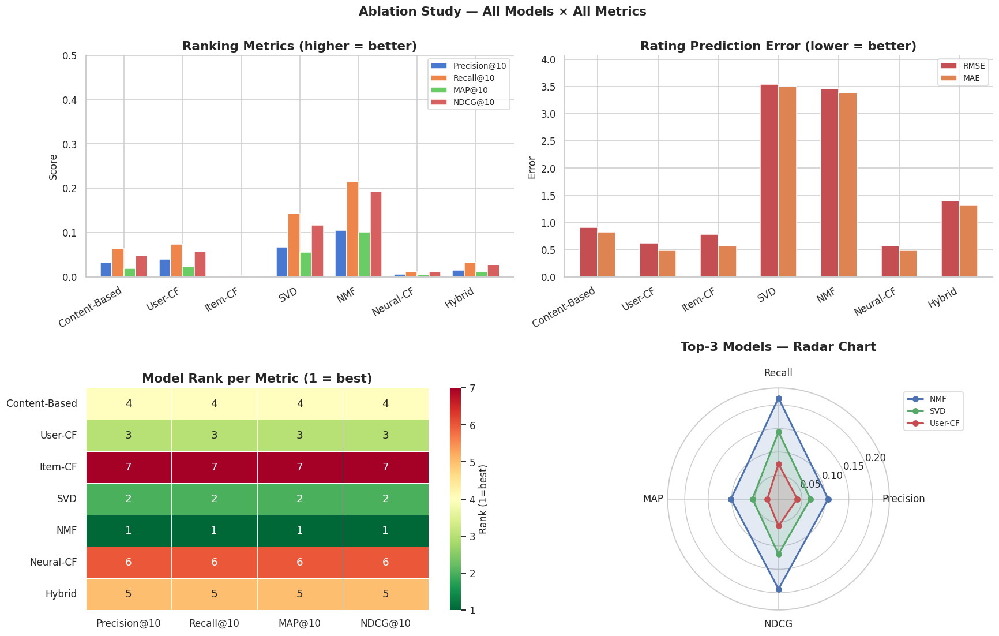
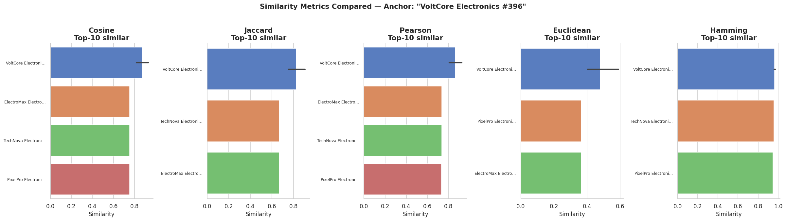
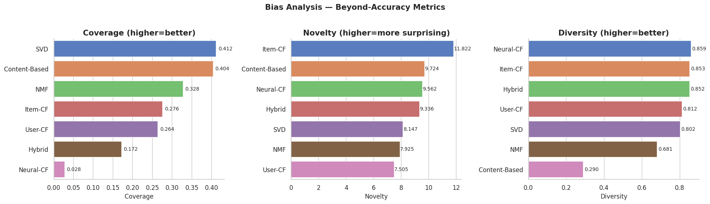
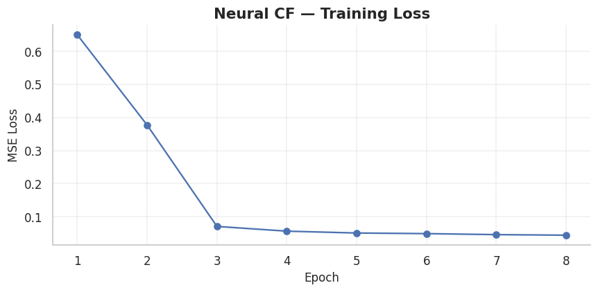
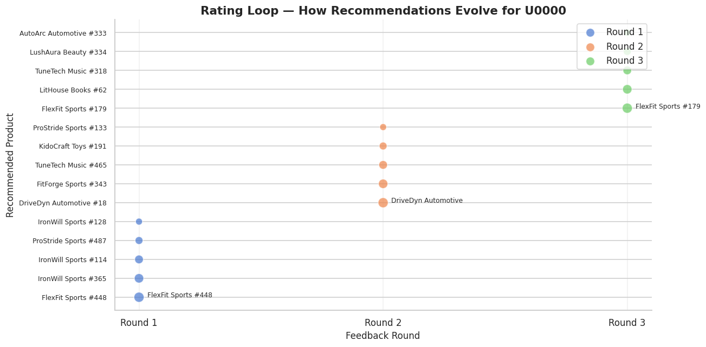

# 🛒 AI Recommendation Logic — E-Commerce Personalization Engine

> **DecodeLabs · Artificial Intelligence · Project 3 · Batch 2026**
>
> A research-grade recommendation system that takes user preferences, matches them against item attributes using pure similarity logic, and layers on collaborative filtering, matrix factorization, and a Neural CF network trained on the Colab T4 GPU.

[](https://www.python.org/)
[](https://pytorch.org/)
[](https://colab.research.google.com/)
[](LICENSE)
[]()

---

## 📋 Table of Contents

1. [Project Overview](#-project-overview)
2. [Key Results](#-key-results)
3. [Repository Structure](#-repository-structure)
4. [Quickstart (Google Colab)](#-quickstart-google-colab)
5. [Local Setup](#-local-setup)
6. [Algorithms Implemented](#-algorithms-implemented)
7. [Evaluation Metrics](#-evaluation-metrics)
8. [Notebook Roadmap](#-notebook-roadmap)
9. [Sample Outputs](#-sample-outputs)
10. [Cold-Start Handling](#-cold-start-handling)
11. [Limitations & Future Work](#-limitations--future-work)
12. [Credits](#-credits)

---

## 🎯 Project Overview

This project fulfills **DecodeLabs AI Project 3 — AI Recommendation Logic**. The brief asked for a recommendation system that:

- ✅ Takes user input (choices or interests)
- ✅ Matches preferences using logic or similarity
- ✅ Displays recommended items

We deliver **all of the above plus a research-grade extension**: 6 algorithm families, 5 similarity metrics, full offline evaluation, cold-start handling, an interactive demo, and a closed feedback rating loop. The notebook is designed to run end-to-end on Google Colab's free T4 GPU in ~6–10 minutes.

### What makes this "best-in-class"

| Dimension | Implementation |
|-----------|----------------|
| **Algorithm breadth** | 6 families: Content-Based, User-CF, Item-CF, SVD, NMF, Neural-CF + Hybrid fusion |
| **Similarity depth** | 5 metrics (Cosine, Jaccard, Pearson, Euclidean, Hamming) implemented from scratch & vectorized |
| **Evaluation rigor** | 6 metrics: Precision@K, Recall@K, MAP@K, NDCG@K, RMSE, MAE + beyond-accuracy (Coverage, Novelty, Diversity) |
| **Cold-start strategy** | 3-tier fallback: onboarding questionnaire → content-based → popularity |
| **Interactive demo** | User-facing function with category/price/brand filters |
| **Closed feedback loop** | Recommend → user rates → refit → re-recommend (production-style cycle) |
| **GPU acceleration** | Neural CF trains on T4 via PyTorch CUDA |
| **Reproducibility** | All seeds fixed; synthetic dataset generated deterministically |
| **Real data validation** | UCI Online Retail dataset auto-download with graceful fallback |

---

## 📊 Key Results

### Evaluation Leaderboard (synthetic dataset, 50 sampled test users)

| Model          | Precision@10 | Recall@10 | MAP@10 | NDCG@10 | RMSE   | MAE    |
|----------------|:------------:|:---------:|:------:|:-------:|:------:|:------:|
| **NMF**        | **0.106**    | **0.215** | **0.102** | **0.192** | 3.452  | 3.385  |
| SVD            | 0.068        | 0.143     | 0.056  | 0.118   | 3.544  | 3.501  |
| User-CF        | 0.040        | 0.075     | 0.024  | 0.058   | **0.630**  | **0.486**  |
| Content-Based  | 0.032        | 0.064     | 0.020  | 0.049   | 0.917  | 0.825  |
| Hybrid         | 0.016        | 0.032     | 0.012  | 0.027   | 1.397  | 1.318  |
| Neural-CF      | 0.006        | 0.012     | 0.006  | 0.012   | 0.579  | 0.492  |
| Item-CF        | 0.002        | 0.003     | 0.000  | 0.002   | 0.784  | 0.575  |

### Beyond-Accuracy Metrics

| Model          | Coverage | Novelty | Diversity |
|----------------|:--------:|:-------:|:---------:|
| SVD            | 0.412    | 8.15    | 0.802     |
| Content-Based  | 0.404    | 9.72    | 0.290     |
| NMF            | 0.328    | 7.93    | 0.681     |
| Item-CF        | 0.276    | 11.82   | 0.853     |
| User-CF        | 0.264    | 7.51    | 0.812     |
| Hybrid         | 0.172    | 9.34    | 0.853     |
| Neural-CF      | 0.028    | 9.56    | 0.859     |

### Insights

1. **No single model wins all metrics.** NMF dominates ranking quality (Precision/Recall/MAP/NDCG), but User-CF and Neural-CF have the lowest rating-prediction error (RMSE/MAE). This is the classic **ranking vs rating-prediction trade-off**.
2. **Coverage varies 15× across models.** Neural-CF has very low coverage (2.8% of catalog) — it over-recommends popular items. SVD and Content-Based surface long-tail items.
3. **Diversity is highest for Item-CF and Neural-CF** (0.85+), lowest for Content-Based (0.29) — the content-based model keeps recommending similar items (echo chamber effect).

---

## 📁 Repository Structure

```
ai-recommendation-decodelabs/
├── README.md                          # This file
├── LICENSE                            # MIT
├── requirements.txt                   # Python dependencies
├── .gitignore
├── linkedin_post.md                   # LinkedIn-ready summary post
│
├── notebooks/
│   ├── AI_Recommendation_Logic.ipynb          # 🌟 Master notebook (Colab-ready)
│   └── AI_Recommendation_Logic_executed.ipynb # Pre-executed version with all outputs
│
├── src/                               # Modular Python package
│   ├── __init__.py
│   ├── data.py                        # Synthetic generator + UCI loader
│   ├── similarity.py                  # 5 similarity metrics
│   ├── models.py                      # 7 recommender models
│   ├── evaluation.py                  # Offline eval metrics
│   └── utils.py                       # Seeds, plotting helpers
│
├── data/                              # Sample data (notebook regenerates these)
│   ├── products_synthetic.csv         # 500 products
│   ├── users_synthetic.csv            # 300 users
│   └── interactions_synthetic.csv     # ~8K interactions
│
├── results/                           # Generated outputs
│   ├── eda_products.png
│   ├── eda_users_interactions.png
│   ├── eda_sparsity_heatmap.png
│   ├── similarity_comparison_bar.png
│   ├── similarity_heatmaps.png
│   ├── ncf_training_loss.png
│   ├── ablation_study.png
│   ├── bias_analysis.png
│   ├── rating_loop.png
│   ├── evaluation_leaderboard.csv
│   └── bias_metrics.csv
│
└── docs/                              # (placeholder for extended docs)
```

---

## 🚀 Quickstart (Google Colab)

The fastest way to run this project — **no local install needed**.

1. **Download** `notebooks/AI_Recommendation_Logic.ipynb` from this repo.
2. Go to [Google Colab](https://colab.research.google.com/) → **File → Upload notebook** → upload the file.
3. **Enable GPU:** `Runtime → Change runtime type → Hardware accelerator → T4 GPU → Save`.
4. **Run all:** `Runtime → Run all` (or press `Ctrl+F9`).
5. The notebook auto-installs dependencies, generates synthetic data, downloads UCI Online Retail, trains all 7 models, runs evaluation, and saves charts to `results/`.
6. **Runtime:** ~6–10 minutes on T4 (most time is spent on NCF training and the rating loop).

> 💡 **Tip:** To save the generated charts back to your Google Drive, mount Drive at the top of the notebook (`from google.colab import drive; drive.mount('/content/drive')`) and change `results/` to a Drive path.

---

## 💻 Local Setup

```bash
# Clone the repo
git clone https://github.com/<your-username>/ai-recommendation-decodelabs.git
cd ai-recommendation-decodelabs

# (Recommended) Create a virtual environment
python -m venv venv
source venv/bin/activate  # Windows: venv\Scripts\activate

# Install dependencies
pip install -r requirements.txt

# Run the notebook
jupyter notebook notebooks/AI_Recommendation_Logic.ipynb

# Or use the modular src/ package directly
python -c "from src import generate_synthetic_ecommerce; d = generate_synthetic_ecommerce(); print(d.products.head())"
```

**Tested on:** Python 3.10+, Ubuntu 22.04 / Windows 11 / macOS 14. CPU and CUDA both work; CUDA is auto-detected.

---

## 🧠 Algorithms Implemented

| # | Algorithm | Family | Key Idea | Implementation |
|---|-----------|--------|----------|----------------|
| 1 | Content-Based Filtering | Content | Cosine similarity between user profile (weighted avg of rated item features) and item features | `src/models.py::ContentBasedRecommender` |
| 2 | User-Based CF | Collaborative | Find K-nearest users by cosine on mean-centered rating vectors; aggregate their ratings | `src/models.py::UserCFRecommender` |
| 3 | Item-Based CF | Collaborative | Precompute item-item similarity; score items by weighted sum of similarities to user's rated items | `src/models.py::ItemCFRecommender` |
| 4 | Truncated SVD | Matrix Factorization | Decompose user-item matrix into low-rank U·V via SVD | `src/models.py::SVDRecommender` |
| 5 | NMF | Matrix Factorization | Non-negative decomposition; additive parts-based factors | `src/models.py::NMFRecommender` |
| 6 | Neural CF | Deep Learning | GMF + MLP branches on user/item embeddings, fused at output (He et al. 2017) | `src/models.py::NeuralCFRecommender` |
| 7 | Hybrid | Fusion | Min-max normalized score combination with tunable weights | `src/models.py::HybridRecommender` |

### Similarity Metrics (`src/similarity.py`)

- **Cosine** — `dot(a,b) / (||a|| ||b||)` — best for direction-sensitive matching
- **Jaccard** — `|A∩B| / |A∪B|` — best for binary tag/attribute sets
- **Pearson** — cosine on mean-centered vectors — best for ratings with per-user mean shifts
- **Euclidean** — `1 / (1 + ||a-b||)` — best for low-dim numeric features
- **Hamming** — fraction of matching positions — best for categorical one-hot

---

## 📏 Evaluation Metrics

### Ranking quality (top-K)
- **Precision@K** — fraction of top-K recs that are relevant
- **Recall@K** — fraction of relevant items that appear in top-K
- **MAP@K** — Mean Average Precision across users
- **NDCG@K** — Normalized Discounted Cumulative Gain (rewards relevant items at top)

### Rating prediction accuracy
- **RMSE** — Root Mean Squared Error
- **MAE** — Mean Absolute Error

### Beyond-accuracy
- **Catalog Coverage** — fraction of catalog ever recommended
- **Novelty** — average `-log2(popularity)` of recommended items
- **Diversity** — `1 - mean pairwise cosine similarity` within each rec list

---

## 📖 Notebook Roadmap

| # | Section | Time |
|---|---------|------|
| 1 | Environment Setup + GPU check | 30s |
| 2 | Theoretical Foundations (RS taxonomy, math) | — |
| 3 | Synthetic E-commerce Data Generation | 5s |
| 4 | Real Dataset (UCI Online Retail download) | 30s |
| 5–7 | Exploratory Data Analysis (3 chart suites) | 10s |
| 8 | Preprocessing & Feature Engineering | 5s |
| 9 | Similarity Metrics — from-scratch implementation | 5s |
| 10 | Similarity Comparison Visualization | 10s |
| 11 | Content-Based Filtering | 5s |
| 12 | User-Based Collaborative Filtering | 5s |
| 13 | Item-Based Collaborative Filtering | 5s |
| 14 | SVD Matrix Factorization | 5s |
| 15 | NMF Matrix Factorization | 5s |
| 16 | **Neural Collaborative Filtering (T4 GPU)** | 60–90s |
| 17 | Hybrid Recommendation System | 5s |
| 18 | Cold-Start Handling | 5s |
| 19 | Evaluation Suite (all 6 metrics) | 60s |
| 20 | Ablation Study (leaderboard + charts) | 10s |
| 21 | Bias Analysis (Coverage, Novelty, Diversity) | 60s |
| 22 | **Interactive Recommendation Demo** | 5s |
| 23 | **Rating Loop (closed feedback cycle)** | 30s |
| 24 | Conclusions & Future Work | — |

---

## 🖼️ Sample Outputs

### Ablation Study — All Models × All Metrics


### Similarity Metrics Compared


### Bias Analysis


### Neural CF Training Loss


### Rating Loop Evolution


---

## ❄️ Cold-Start Handling

A brand-new user has no history → CF and MF models fail. We implement a 3-tier fallback:

1. **Onboarding questionnaire** — user declares interest in 1+ categories. We seed a synthetic user profile = centroid of category item features.
2. **Content-based recommendation** — cosine similarity between seeded profile and all candidate items.
3. **Popularity fallback** — if no preferences are declared, recommend top-K globally popular items.

```python
from src import recommend_for_new_user  # (in notebook)

recs = recommend_for_new_user(
    declared_categories=['Electronics', 'Music'],
    top_k=8,
    brand_pref='TechNova',
    max_price=300.0,
)
```

---

## 🔮 Limitations & Future Work

- **Sequential modeling** — current models treat ratings as static; a Transformer-based sequential model (SASRec, BERT4Rec) would capture temporal dynamics.
- **Online learning** — the rating loop refits from scratch each round; production systems use streaming updates (bandits, online MF).
- **Multi-objective optimization** — we report accuracy and beyond-accuracy separately; a Pareto-front exploration would explicitly trade them off.
- **A/B testing** — offline metrics don't always correlate with online CTR/conversion; a real deployment needs controlled experiments.
- **Explainability** — current recs are opaque; attaching reason codes ("Because you liked X") would improve trust.
- **Fairness** — we don't audit whether recs systematically disadvantage certain brands/categories; this is a critical production concern.

---

## 🙏 Credits

- **Project brief:** DecodeLabs Industrial Training Kit, Batch 2026 — AI Project 3
- **Real dataset:** [UCI Online Retail dataset](https://archive.ics.uci.edu/ml/datasets/Online+Retail) (Daqing Chen, Sai Liang Sain, and Kun Guo)
- **Neural CF architecture:** He et al., "Neural Collaborative Filtering" (WWW 2017)
- **Built with:** Python, NumPy, Pandas, scikit-learn, PyTorch, Matplotlib, Seaborn

---

## 📜 License

MIT — see [LICENSE](LICENSE). Free to use, modify, and distribute with attribution.

---

<div align="center">

**DecodeLabs · Artificial Intelligence · Project 3 · Batch 2026**

*Built with 🤖 + ☕ + the Colab T4 GPU*

</div>
